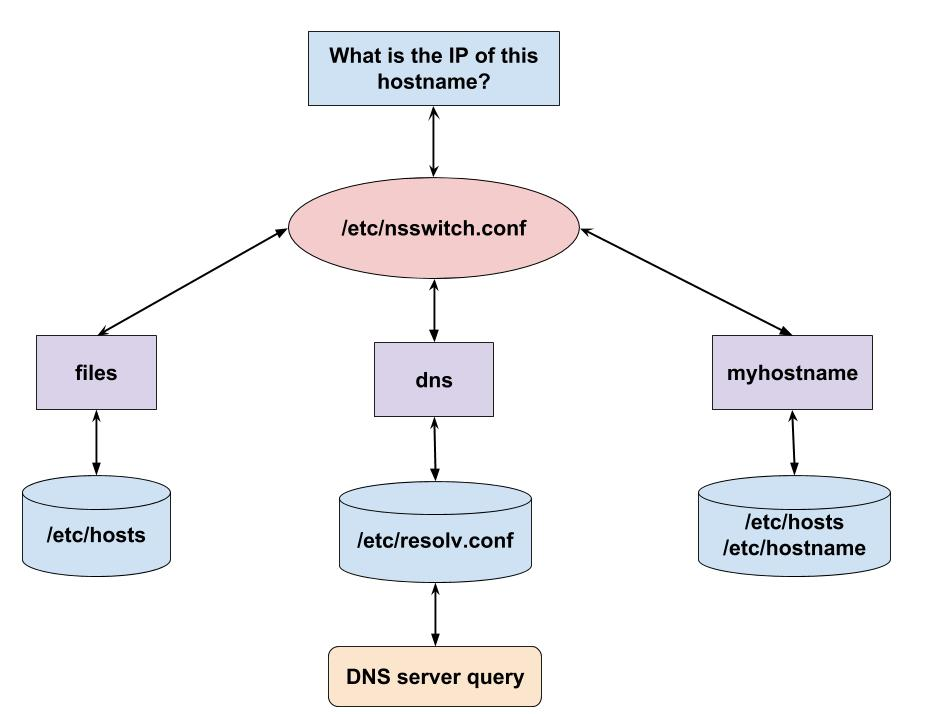

## Linux DNS lookup

_The first thing to grasp is that there is no single method of getting a DNS lookup done on Linux and it’s not a core system call with a clean interface._

There are several ways of name resolution. Most applications and tools ([not all of them](https://zwischenzugs.com/2018/06/08/anatomy-of-a-linux-dns-lookup-part-i/)) consult the **/etc/nsswitch.conf** on the order they should try these different methods to resolve a DNS hostname.

### /etc/nsswitch.conf

The `Name Service Switch` (`NSS`) configuration file, `/etc/nsswitch.conf` was originally created as part of the Solaris OS to allow applications to not have to hard-code which file or service they have to consult in order to retrieve name-service information in a range of [categories](http://man7.org/linux/man-pages/man5/nsswitch.conf.5.html) and in what order. For example, this configuration file affects how programs perform user groups or passwords lookups and how DNS names are tried to be resolved.

The important in this file with regards to DNS is `hosts`. For example, my default `/etc/nsswitch.conf` looks like this:

```bash
...
hosts:      files dns myhostname
...
```

This configuration line defines three methods of DNS name resolution and the order in which they should be tried. It says that the program should:

1. First, try to resolve a name using the `/etc/hosts` file which contains some mappings of hostnames to IP addresses
2. If the `/etc/hosts` file doesn't have the required entry, consult one of the DNS servers mentioned in the `/etc/resolve.conf` file
3. Finally, the `myhostname` option allows to always resolve local system hostname.



### /etc/hosts

Before the advent of a distributed domain name system (DNS); networked computers used local files to map hostnames to IP addresses. On Unix systems this file was named `/etc/hosts` or `"the hosts file"`. In those days, networks were small and managing a file with a handful of hosts was easy.

In modern days with the Internet having somewhere around 246 million domain names (as of 2012) the hosts file has been replaced with a more scalable distributed DNS service. While the hosts file is not used to map all hostnames to IPs these days it can still be used sometimes (see examples of [when to use and not use the hosts file](http://bencane.com/2013/10/29/managing-dns-locally-with-etchosts/)).

The hosts file has a very simple format:

```
[IP address] [official hostname] [alias1] [alias2] ...
```

For example, the default hostname file on my virtual machine looks like this:

```bash
127.0.0.1   localhost localhost.localdomain localhost4 localhost4.localdomain4
::1         localhost localhost.localdomain localhost6 localhost6.localdomain6
```

The primary present-day use of the hosts file is to bypass the DNS resolution. If the name searched (like `localhost`) is found in the file, no DNS resolution will be performed at all.

Let's see how it works and add another entry to the hosts file:

```bash
$ sudo echo "192.168.0.1 example.com example" >> /etc/hosts
$ cat /etc/hosts
127.0.0.1   localhost localhost.localdomain localhost4 localhost4.localdomain4
::1         localhost localhost.localdomain localhost6 localhost6.localdomain6
192.168.0.1 example.com example
```

Now if I [ping](ping.md) `example.com` hostname (or its alias `example`) the data packets will be send to `192.168.0.1` IP address, although it's not the actual IP address of the site `example.com`:

```bash
$ ping -c 1 example.com
PING example.com (192.168.0.1) 56(84) bytes of data.
...
$ ping -c 1 example
PING example.com (192.168.0.1) 56(84) bytes of data.
...
```

We can lookup the real IP address of `example.com` site by using DNS lookup command-line tools like [host](host.md), [dig](dig.md), or [nslookup](nslookup.md) [which ignore /etc/nsswitch.conf](https://serverfault.com/questions/498500/why-does-the-host-command-not-resolve-entries-in-etc-hosts) and always use the DNS for name resolution:

```bash
$ host example.com
example.com has address 93.184.216.34
example.com has IPv6 address 2606:2800:220:1:248:1893:25c8:1946
```

### /etc/resolv.conf

The `/etc/resolv.conf` file defines how the system uses DNS to resolve hostnames.

The most common configuration options in `/etc/resolv.conf` are the following.

#### nameserver

`nameserver` is used to specify an IP address of a DNS server to contact for hostname resolution. There could be no more than 3 `nameserver` entries in `/etc/resolv.conf`.

```
nameserver 192.168.0.100
nameserver 8.8.8.8
nameserver 8.8.4.4
```

By default, the nameservers are used in listed order (i.e. from top to bottom) with a 5-second timeout before moving to the next entry. You should therefore put the most reliable server first. See the [options directive](https://serverfault.com/questions/456700/order-of-nameservers-in-resolv-conf) for how to rotate the use of nameservers.

If no nameserver option is given, the resolver attempts to connect to the nameserver on the localhost (i.e. 127.0.0.1).

#### domain & search

These options are very similar. They are both used for completing a given query name to a [fully qualified domain name](dns.md) (FQDN) when no domain suffix is supplied.

Only one of them can be specified in the `/etc/resolv.conf`. If both of them specified the one specified the last is used.

Example of `domain`:

```
domain example.com
nameserver 192.168.0.100
nameserver 8.8.4.4
```

Now let's see what I will get, if I query `www` using the [host](host.md) command (note, that [dig](dig.md) works a bit won't give the same results)

```bash
$ host www
www.example.com has address 93.184.216.34
www.example.com has IPv6 address 2606:2800:220:1:248:1893:25c8:1946
```

When I query the `www` hostname and a DNS server can't resolve it, my computer tries to make another query appending the name of the `domain` specified in `/etc/resolv.conf` to my original hostname.

The `search` option allows you to specify a _list_ of domains which can be appended to your query. Thus, it's a more powerful option and used more often than the `domain`. For example:

```
search example.com example.org
nameserver 192.168.0.100
nameserver 8.8.4.4
```

Now if I try to resolve `test` hostname, my computer will try to resolve `test` hostname first, if it fails it will try `test.example.com` followed by `test.example.org`. It will answer of the first query that was successful.

### Anatomy of a Linux DNS lookup:

Great posts explaining how DNS lookup is performed on Linux:

* [Part I](https://zwischenzugs.com/2018/06/08/anatomy-of-a-linux-dns-lookup-part-i/)
* [Part II](https://zwischenzugs.com/2018/06/18/anatomy-of-a-linux-dns-lookup-part-ii/)
* [Part III](https://zwischenzugs.com/2018/07/06/anatomy-of-a-linux-dns-lookup-part-iii/)

### Resources used to create this document:

* http://bencane.com/2013/10/29/managing-dns-locally-with-etchosts/
* https://unix.stackexchange.com/questions/421491/what-is-the-purpose-of-etc-hosts
* https://zwischenzugs.com/2018/06/08/anatomy-of-a-linux-dns-lookup-part-i/
* https://bash-prompt.net/guides/resolv-conf/
* https://docs.oracle.com/cd/E37670_01/E41138/html/ch11s02s03.html
* https://serverfault.com/questions/456700/order-of-nameservers-in-resolv-conf
* https://www.tldp.org/LDP/nag/node84.html
* https://www.shellhacks.com/setup-dns-resolution-resolvconf-example/
* man resolv.conf
