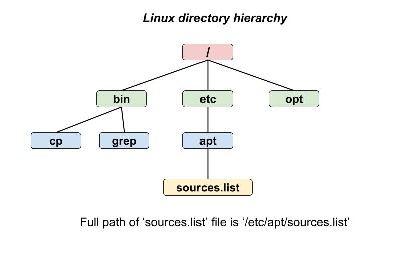
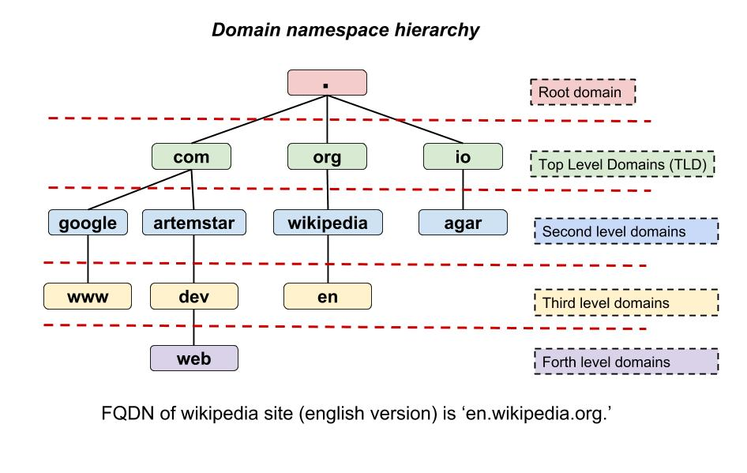
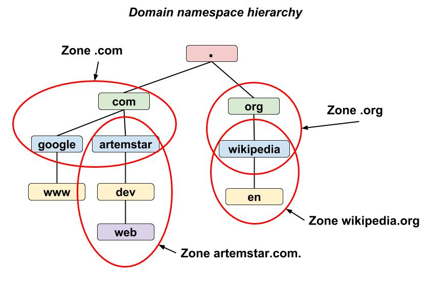
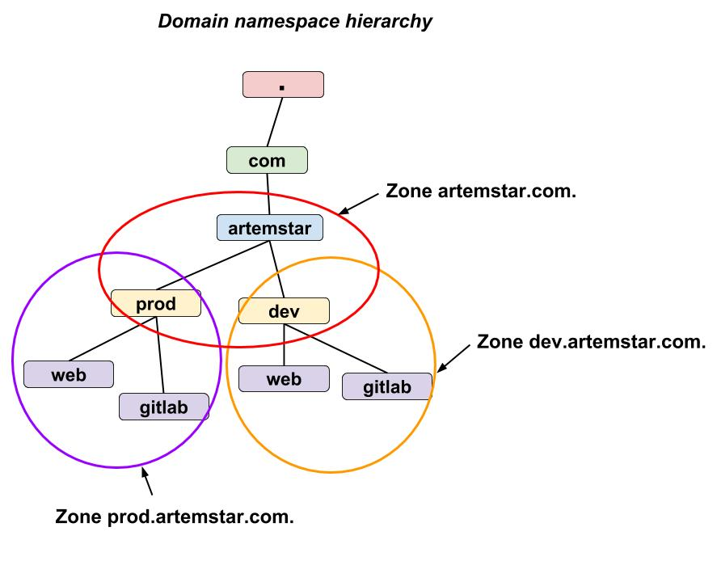
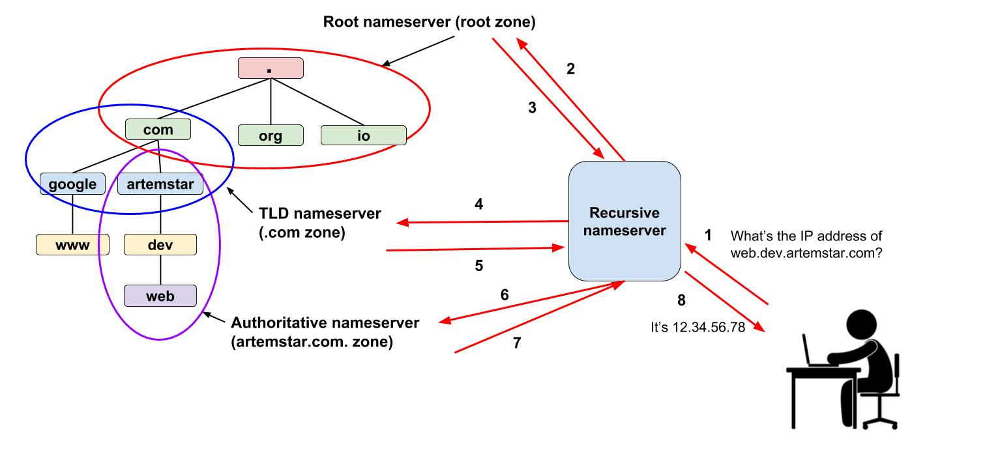

## DNS

### The Basics

All devices (e.g. computers, cell phones, routers) that are connected to a computer network such as the Internet, are identified by an **IP address**; which is a number.

IP addresses are easy for computers to process but they are not so easy for humans to remember. Besides, IP addresses are _logical addressses_, meaning they are not hard-wired into each device, but assigned to a device by some external system like DHCP or [IANA](https://en.wikipedia.org/wiki/Internet_Assigned_Numbers_Authority) organization which oversees global IP address allocation. This means that the IP address of a device can be easily changed.

How do we deal with these problems and make devices (referred to as **hosts** further) easier to identify for people?

People decided to associate an IP address of a network host with a catchy name (**hostname**) that will be easy to remember. It required the creation of a special system whose function was to hanlde the mapping of IP addresses to hostnames. As you can guess, the system was called **Domain Name System** (**DNS**).

The **DNS** makes it possible for computers to _resolve_ a hostname requested by a human (e.g. `google.com`) to an IP address (e.g. `172.217.6.78`) which can then be used to send data packets to that host.

The DNS system is implemented by **DNS servers** . A DNS server (also referred to as a **nameserver**) is a piece of software and an actual database which holds the mappings of hostnames to IP addresses and answers name resolution requests. There are several different types of DNS servers, see below.

To make the hostname IP address lookup process fast and efficient, the DNS defines the format for the hostnames.

A DNS name for a host has a _hierarchical_ or _tree structure_. A host name definition works very similar to how we define the path of a file in a Linux filesystem. Remember how it all starts with a root directory (`/`) followed by the names of nested directories separated by a slash (`/`) and ends with a filename:



A host DNS name is defined just about the same way. The only difference is that instead of directories, we use **domain names** or simply **domains**.



A DNS name starts with a root domain (`.`) followed by a top level domain (TLD) name (e.g. `com`, `org`), a second-level domain, possibly third, forth domain until the host is identified. All domains are separated by the dot (`.`) and the complete DNS name of a network host is called **Fully Qualified Domain Name** (**FQDN**).

The hierarchial structure of DNS names allows to delegate responsibility for keeping records of each domain to different DNS servers. For example, one server will keep records for the top level domains, another will be storing records for `wikipedia` **subdomain**, i.e. a domain that's one level lower in the domain name hierarchy, different servers will be used to store DNS records for `google`, `yahoo`, `facebook` and so on.

_Thus, we can call DNS as a distributed hierarchial database._ 

Just imagine if it was a one database, how big it would be with all the millions of IP addresses that we have on the Internet? How long it would take to search for required records? And it would certainly make it very difficult to create and update new records as people create more and more new domains. The distibuted structure of DNS allows to decrease the pressure on a single server.

To be able to keep track of all the domains on the Internet and connect them in a one system, all the domains should be registered through a registration authorities called [domain name registars](https://en.wikipedia.org/wiki/Domain_name_registrar) or simply **registrars**. Registrars are typically accredited by the Internet Corporation for Assigned Names and Numbers (ICANN) which is a private (non-government), non-profit organization that has been given the responsibility of allocating IP addresses and managing the Domain Name System. Registrars allow to register domains under top level domains (TLDs), e.g. `.com`, `.net`, `.org`.

Here's how you typically create a public domain name for your website or your app. You buy a second level domain of your choice from a registar such as Namecheap or GoDaddy, provide address information (DNS name or IP address) to the registrar about the DNS server that will provide name resolution service for that domain (it needs it so that DNS servers for TLDs know what server to refer to in case they will be asked about records under your domain), then you're free to run your own DNS server for your domain (and its subdomains) and create how many DNS names you want.

### Domain terminology

As we mentioned, a DNS hostname has a hierarchial structure and split into parts called **domains** or **domain names**. There is quite a bit of different terminology that is used to call domains at different levels and their combinations, tha's why below I will give definitions of some of the common terms you can hear when talking about DNS domains.

#### TLD

The **top-level domain** (**TLD**) is commonly known as the last part of the name of any website, domain, or email address. It's the domain that follows right after the root domain (`.`). Some examples of TLD include `.com`, `.io`, `.org`, `.net`, and so on.

There are two categories of TLDs: **gTLDs** and **ccTLDs**.

The **country code TLDs** (`ccTLDs`) represent an abbreviation of the country name also called [country codes](https://en.wikipedia.org/wiki/Country_code). Examples include `.uk` for the United Kingdom and `.ru` for Russia. When country codes are used, a second-level hierarchy for the TLD is often introduced to identify the type of the registered entity. For example, the `.co.uk` TLD identifies commercial enterprises in the United Kingdom.

The **generic top-level domains** (`gTLDs`) as the name suggests, are generic. They are not bound to any specific country. Examples include `.com`, `.org`, `.net`.

#### Apex domain

The **apex domain name** is a combination of a TLD plus a second level domain following it. For example, in `www.example.com`, the name of the apex domain is `example.com`. In `www.example.co.uk`, the name of the apex domain is `example.co.uk`.

Note, instead of `apex domain` term you will also often see **base domain**, **bare domain**, **root apex**, or **zone apex** used in the same sense.

#### Subdomain

Technically, **subdomain** is any domain that precedes another upper level domain. For example, in `example.com.` the `example` domain is a subdomain under the TLD `.com`.

However, most of the time when people say subdomain they refer to one of the domain names following the _apex domain_. For example, in `jake.dog.animals.example.com`, the subdomains are jake, dog, and animals. The most common subdomain name is `www` as in `www.example.com`.

#### FQDN

A **fully qualified domain name** (**FQDN**) is a _complete DNS name_ for a computer, website, or other resource connected to a network. It includes the names of all domains used to identify that resource on the network and has the following format:

```
[subdomain1].[subdomain2]...[subdomainn].[apex domain].[top–level domain].
```

For example, `aws.amazon.com` is the FQDN for Amazon Web Services. A FQDN includes all domains up to the top–level domain.

### Zones

_**DNS zones** represent a mechanism for storing information about domains on DNS servers._

We already mentioned the hierachial structure of DNS names and how it allows delegate responsibilies for serving information about different domain names in that hierarchy to different nameservers. Technically, it's not just a single domain name that gets delegated to a particular nameserver, it could be multiple contiguous domains. That portion of domain namespace (which can include one domain or multiple contiguous domains) that gets delegated to a nameserver is called a **DNS zone**.



In the picture above, you can see examples of DNS zones. Each DNS zone represents a portion of DNS namespace that can be delegated to be managed by different people and served by different nameservers. As you can see, DNS zone can include first level subdomains under one domain, e.g. `.com`, `.org`, `wikipedia.org.` zones, or it can include serveral contiguous domains, e.g. `artemstar.com.`.

As we said, zones allow to delegate administrative responsibility for a portion of DNS namespace to different nameservers. But we should also note, that one nameserver can be serving multiple DNS zones. For example:



So in this example, I own the domain `artemstar.com` and use it for my website. I decide to split my apex domain in two subdomain namespaces: one for creating DNS records for hosts in my `dev` environment and one for creating records for `prod` environment hosts. I could've used a single DNS zone (thus a single `zone file`, see below) for my domain and all its subdomains, but since DNS records within the zone are managed together I decide not to mix the DNS records for two different environments and create 2 extra zones, i.e. one for each subdomain. And I can configure my DNS server, that I use for my apex domain zone, to also provide name resolution service for my two subdomain zones.

Okay, now that we've grasped the idea behind the DNS zones, let's see we actually store records using zones.

A **zone file** is used to describe a DNS zone. A zone file is a text file which is stored on the nameserver and holds DNS records for the domains that zone is responsible for.

Here is an example of a basic zone file:

```
$ORIGIN example.com. 
$TTL 86400 
@	IN	SOA	ns1.example.com.	admin.example.com. (
			2001062501 ; serial number
			21600      ; refresh after 6 hours
			3600       ; retry after 1 hour
			604800     ; expire after 1 week
			86400 )    ; minimum TTL of 1 day  
		     
		           
@	IN	NS	ns1.example.com.
@	IN	NS	ns2.example.com.

	
ns1	  IN	A	10.0.1.1
ns2	  IN	A	10.0.1.2

gitlab  IN  A 10.0.1.100
```

The DNS zone file consists of `directives` and `resource records`. Directives begin with a `$`. In this example, we have two directives:

* `$ORIGIN example.com.` defines the base domain (the most upper level domain) for this zone. This domain will also be appended to any hostname below that doesn't end with a trailing period (`.`).
* `$TTL 86400` sets the default Time to Live (TTL) value for the zone. This is the length of time, in seconds, that a zone resource record is valid. Increasing this value allows remote nameservers/clients to cache the zone information for a longer period of time, reducing the number of queries for the zone. Each resource record can contain its own TTL value, which overrides this directive.

The directives are followed by a **Start of Authority** (**SOA**) record. This record defines important information about the DNS zone and should be present in each zone file. Let's look at the syntax of this record:

* as [any resource record](http://www.zytrax.com/books/dns/ch8/), it starts with a hostname which in this case is indicated by `@`. The `@` is a special symbol and is a shorthand for `$ORIGIN`.
* `IN` shows the protocol that `Internet protocol` (IP) is used to identify the host.
* `SOA` shows the type of DNS record (see types of records below).
* `ns1.example.com` indicates the FQDN of the primary nameserver which holds the original zone file. There are often secondary nameservers for the zone to provide high avaliability (HA). The primary server is where zone file changes get made before they are propagated to all other nameservers.
* `admin.example.com.` is the email address of the person/organization responsible for managing this zone. Note that instead of `@` symbol in the email address the `.` is used, so the actual email is `admin@example.com`
* numbers in the brackets mean:
  * `serial number`: a numerical value that is incremented each time the zone file is changed. It is used by the secondary servers to determine if it is using outdated zone data and should therefore refresh it.
  * `refresh time`: the amount of time (in seconds) a secondary DNS server will wait before asking the primary nameserver if any changes have been made to the zone file.
  * `retry time`: the amount of time to wait after which a refresh fails before trying to refresh again
  * `expire time`: the amount of time a secondary DNS server will wait before expiring its current zone file copy if it cannot update itself. If the master has not replied to a refresh request before the amount of time specified in the `expire time` directive elapses, the secondary servers stop responding as an authority for requests concerning that namespace.
  * `minimum TTL`: the minimum amount of time other servers should keep data cached from this zone file

The nameserver type of records (**NS**) which are following the `SOA` specify **autoritative nameservers** for this DNS zone. autoritative nameservers for the zone are called the DNS servers responsible for providing name resolution service for that zone. As you can see, there are `NS` records for the primary nameserver (`ns1.example.com`) as well as any secondary nameservers (`ns2.example.com`).

The authoritative nameservers have **A** records which tie the FQDN to the IPv4 address. Since the `ns1` and `ns2` names do not end in a trailing period (`.`), the `$ORIGIN` domain is appended to expand them to the FQDNs, i.e `ns1.example.com` and `ns2.example.com`.

Similarly, the A type of record is defined for `gitlab.example.com` which allows us to resolve that FQDN to the IP address of `10.0.1.100` if we query that nameserver.

### Types of DNS records

We already mentioned a few types of DNS records that can be created in the zone files. In this sections, I'll summorize the major record types.

#### A and AAAA

An `A` (stands for address Address) record points a FQDN to an IPv4 IP address which is the core function of DNS. For example:

```
example.com        IN    A       12.34.56.78
test.example.com   IN    A       12.34.56.100
```

An `AAAA` record is just like an `A` record, but for IPv6 IP addresses. A typical AAAA record looks like the following:

```
example.com        IN   AAAA        0123:4567:89ab:cdef:0123:4567:89ab:cdef
```

#### CNAME

A `CNAME` (stands for Canonical Name) record maps one DNS name to another and essentially functions as an `alias` for a DNS record. Consider the following example:

```
alias.com    IN   CNAME   example.com.
example.com  IN   A       12.34.56.78
```

With this setup, when `alias.com` is requested, the initial DNS lookup will find the CNAME entry with the target of `example.com`. A new DNS lookup will be started for `example.com`, which will find the IP address `12.34.56.78`. Finally, visitors to `alias.com` will be directed to `12.34.56.78`.

#### NS

The `NS` (stands for Name Server) type of record defines the _authoritative nameservers_ for a particular zone.
Again, autoritative nameservers for a zone are those DNS servers who are responsible for serving information about that zone. For example, your zone file could contain the following records:

```
example.com   IN   NS      ns1.example.com.
example.com   IN   NS      ns2.example.com.
```

Note that when you register your domain with a domain name registrar and you will need to provide the FQDN of your autoritative servers to your registrar. It's necessary so that the nameservers responsible for top level domains such as `.com`, `.org` would know what DNS server to refer to when receiver requests regarding your domain (see how name resolution works below).

You can also set up different nameservers for any of your subdomains, if, for example, you decide to delegate them to different zones. Subdomain NS records get configured in your primary domain’s zone file. For example, if you could configure separate NS records in your zone file for the subdomain `dev.example.com` as shown below:

```
dev.example.com   IN   NS      ns1.dev.nameserver.com
dev.example.com   IN   NS      ns2.dev.nameserver.com
```

#### MX

The `MX` (stands for Mail eXchange) type of record sets the mail deliver destination for a domain or subdomain.

```
example.com        IN   MX      10  mail.example.com.
mail.example.com   IN   A           12.34.56.78
```

The above records direct mail for `example.com` (this is the part after `@` symbol in email address) to the `mail.example.com` host. The target domain `mail.example.com` above needs to have its own `A` record that resolves to your mail server host.

Priority is another component of MX records. This is the number written between the record type and the target server (`10` in the example above). Priority allows you to designate a fallback server(s) for mail for a particular domain. Lower numbers have a higher priority. Here’s an example of a domain that has two fallback mail servers:

```
example.com        IN   MX      10  mail_1.example.com
example.com        IN   MX      20  mail_2.example.com
example.com        IN   MX      30  mail_3.example.com
```

In this example, if mail_1.example.com is down, mail will be delivered to mail_2.example.com. If mail_2.example.com is also down, mail will be delivered to mail_3.example.com

#### TXT

A `TXT` record or text record is used to provide text information about a domain. It’s a flexible type of DNS record that can serve many different purposes depending on the specific contents. One common use of the TXT record is to create an [SPF](https://www.linode.com/docs/networking/dns/dns-records-an-introduction/#spf) record on nameservers that don’t natively support SPF. Another use is to create a [DKIM](https://www.linode.com/docs/networking/dns/dns-records-an-introduction/#dkim) record for mail signing.

#### SOA

The Start Of Authority type of record was described in detail in the zones section.

### Types of nameservers

A DNS zone is defined through the use of a zone file, which contain definitions of the DNS records in that zone.
The DNS server which stores this zone file and uses it to respond to queries regarding domains in that zone is called a nameserver autoritative for that zone (or simply an **authoritative nameserver**). 

_Authoritative nameservers answer to resource records that are part of their zones only_.

Zone files are stored on **primary nameservers** (also called **master nameservers**), where changes are made to the files, and **secondary nameservers** (also called **slave nameservers**), which receive zone definitions from the primary nameservers and are used to provide redundancy.

_Both primary and secondary nameservers are authoritative for the zone and look the same to clients._

There is also another type of nameservers - **recursive nameservers**. They offer name resolution services, but they are not autoritative for any zone offer resolution services.

_Recursive nameservers answer to all domain name queries and are responsible for providing the IP address of the requested domain name to the requesting host._ Think of it as a search engine which searches other pages; it is one that responds to each query by asking various autoritative nameservers for the answer.

DNS nameservers typically serve on port `53` and use `UDP` as the transport protocol for data exchange.

### Name resolution process

**DNS domain name resolution** or **DNS lookup** is the process of quering DNS servers in attempt to get an IP address of a host which associated with the domain name.

Let's how look at an example of a DNS domain name resolution process.



When you type a website name into your browser, such as `web.dev.artemstar.com`, your computer first has resolve this FQDN to an IP address before it will be able to contact the host where this website is running. This process typically consists of the following steps:

0. Before your computer contacts any DNS server, it looks into its own local DNS cache which stores information that your computer recently received from recursive DNS servers. If your computer doesn’t already know the IP address for that FQDN, it needs to perform a DNS query to find out.
1. If the information is not stored locally, your computer queries (contacts) a recursive DNS servers. Often times, you will be using your `ISP’s` recursive DNS servers which addresses you receive when you connect to the network. Recursive nameservers perform the legwork of a DNS query on your behalf, i.e. they will be asking all the other nameservers to resolve your FQDN and provide you only the result. Recursive servers have their own caches, so they may answer your query using cached data.
2. If the recursive server doesn’t have the answer to your query in its cache, it queries the `root nameservers`. There are thirteen root nameservers that act as a kind of telephone switchboard for DNS. They don’t know the answer, but they can direct our query to another nameserver that knows where to find it.
3. The root nameserver will look at the first part of our request, reading from right to left — `.com` — and direct our query to the `TLD nameservers` for `.com` zone.
4. The recursive nameserver will query the `TLD nameserver` that was **referred** to by the root nameserver.
5. Each TLD, such as `.com`, `.org`, and `.io`, have their own set of nameservers, which act like a receptionist for each TLD. These servers don’t have the information we need, but they can refer us directly to the servers that do have the information. The TLD nameserver will review the next part of our request — `artemstar.com` — and direct our query to the nameservers responsible for this specific domain.
6. The recursive nameserver will query the `authoritative nameserver` that was **referred** to by the TLD nameserver. The authoritative nameservers are responsible for knowing all the information about a specific domain. Because this nameserver is responsible for the zone where the record we want exists, it will anwer our query. There are many types of records, which each contain a different kind of information. In this example, we want to know the IP address for `web.dev.artemstar.com`, so we ask the authoritative nameserver for the Address Record (A). 
7. The recursive server retrieves the A record for `web.dev.artemstar.com` from the authoritative nameservers and stores the record in its local cache. If anyone else requests the host record for dyn.com, the recursive servers will already have the answer and will not need to go through the lookup process again. All records have a time-to-live (`TTL`) value, which is like an expiration period. After the time specified in the record's TTL, the recursive server will need to ask for a new copy of the record to make sure the information doesn’t become out-of-date.
8. Finally, the recursive server returns the A record back to your computer. Your computer stores the record in its cache, reads the IP address from the record, then passes this information to your browser. The browser then opens a connection to the webserver and receives the website.

This entire process, from start to finish, takes only milliseconds to complete.

### Recursive & Non-Recursive queries

Very well explained [here](http://www.steves-internet-guide.com/dns-lookups/).

### Resources used to create this document:

* https://docs.aws.amazon.com/acm/latest/userguide/acm-concepts.html#concept-dn
* https://webhostinggeeks.com/guides/dns/
* https://www.youtube.com/watch?v=JIwi6ii-rzI
* http://www.think-like-a-computer.com/2011/06/11/dns-zones-explained/
* https://www.centos.org/docs/5/html/Deployment_Guide-en-US/s1-bind-zone.html
* https://www.linode.com/docs/networking/dns/dns-records-an-introduction/
* https://help.dyn.com/how-to-format-a-zone-file/
* https://www.thegeekdiary.com/understanding-dns-zone-files/
* https://access.redhat.com/documentation/en-us/red_hat_enterprise_linux/6/html/deployment_guide/ch-dns_servers#s2-dns-introduction-zones
