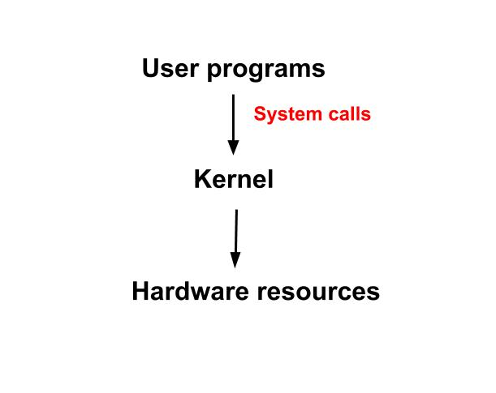
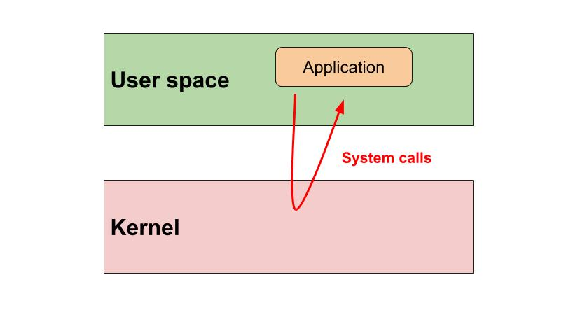

## Kernel

The **kernel** is a program that constitutes the central core of a computer operating system. It has complete control over everything that occurs in the system.

_In general terms, the kernel is a software code that serves as a management layer between the hardware and user programs that run on a computer._

The kernel is the first part of the operating system to load into memory during booting (i.e., system startup), and it remains there for the entire duration of the computer session because its services are required continuously.

### What are the functions of the kernel?

_The kernel is responsible for enabling multiple applications to effectively share the hardware by controlling access to CPU, memory, disk I/O, and networking._

Process management, possibly the most obvious aspect of a kernel to the user, is the part of the kernel that ensures that each process obtains its turn to run on the processor (CPU) and that the individual processes do not interfere with each other by writing to their areas of memory. A process, also referred to as a task, can be defined as an executing (i.e., running) instance of a program.

It is not necessary for a computer to have a kernel in order for it to be usable, the reason being that it is not necessary for it to have an operating system. That is, it is possible to load and run programs directly on bare metal machines (i.e., computers without any operating system installed), although this is usually not very practical. Running multiple programs would be very difficult and the programmer would have to implement access to hardware inside his programs, make sure one program doesn't overwrite memory of another, switch CPU between the programs, etc.

### The contents of the kernel

The term `kernel` is frequently used in books and discussions about Linux, whereas it is used less often when discussing some other operating systems, such as the Microsoft Windows systems. The reasons are that the kernel is highly configurable in the case of Linux and users are encouraged to learn about and modify it and to download and install updated versions. With the Microsoft Windows operating systems, in contrast, there is relatively little point in discussing kernels because they cannot be modified or replaced.

The contents of a kernel vary considerably according to the operating system, but they typically include:

1. a `scheduler`, which determines how the various processes share the kernel's processing time (including in what order)
2. a `supervisor`, which grants use of the computer to each process when it is scheduled
3. an `interrupt handler`, which handles all requests from the various hardware devices (such as disk drives and the keyboard) that compete for the kernel's services
4. a `memory manager`, which allocates the system's address spaces (i.e., locations in memory) among all users of the kernel's services.

### Kernel space vs User space

Because of its critical nature, the kernel code is usually loaded into a protected area of memory called [kernel space](http://www.linfo.org/kernel_space.html), which prevents it from being overwritten by other, less frequently used parts of the operating system or by application programs. The kernel performs its tasks, such as executing processes and handling interrupts, in kernel space, whereas everything a user normally does, such as writing text in a text editor or running programs in a GUI (graphical user interface), is done in [user space](http://www.linfo.org/user_space.html). This separation is made in order to prevent user data and kernel data from interfering with each other and thereby diminishing performance or causing the system to become unstable (and possibly [crashing](terms.md)).

When a computer crashes, it actually means the kernel has crashed. If only a single program has crashed but the rest of the system remains in operation, then the kernel itself has not crashed. A crash is the situation in which a program, either a user application or a part of the operating system, stops performing its expected function(s) and responding to other parts of the system. The program might appear to the user to freeze. If such program is a critical to the operation of the kernel, the entire computer could stall or shut down.

### User mode vs Kernel mode

One of the main goals of the operating system (and its core part - the kernel) is to provide an interface for the users and their programs to computer hardware. The operating system (the kernel part) ensures fair resource allocation to users and programs, isolates program resources from each other (e.g. each problem is allocated its own adress space in memory), and regulates what program and when should access hardware devices such as disk, CPU.

Therefore, the operating system must prevent direct access to hardware devices by user programs. It must also limit each program's access to main memory, to only that adress space that was allocated to the program.

These restrictions are typically built into the CPU (i.e into unchangeable hardware) as two operating modes: **user** and **kernel mode**.

When the CPU is in **kernel mode**, it is assumed to be executing _trusted software_, and thus the executing code has complete and unrestricted access to the underlying hardware. It can execute any instructions and reference any memory addresses (i.e., locations in memory). The kernel (which is the core of the operating system and has complete control over everything that occurs in the system) is trusted software and executed by CPU in kernel mode. Crashes in kernel mode are catastrophic; they will halt the entire computer.

All programs other than the kernel are considered _untrusted software_ and executed by CPU in **user mode**. In user mode, all hardware devices are hidden, and most of main memory is hidden. Instructions relating to device access, interrupt handling and mode changing (i.e. switching to `kernel mode`) cannot be executed either.

Due to the protection afforded by this sort of isolation, crashes in user mode are always recoverable, meaning that instead of your entire system crashing, only that particular application crashes. That's the value of user mode.

The kernel forces all user processes to run in user mode. A process running in user mode can only see its own memory and cannot see the operating system's instructions or data. Any attempt to violate the user mode will cause an **exception**, which is caught by the kernel. This ensures that user processes cannot hijack the operation of the system.

### System calls

Remember that access to hardware is managed by the kernel. For user proccess the hardware is compteley abstracted away, they simply don't see any hardware devices because of the restrictions of CPU user mode.

This means that if a program wants to read a file from disk or get a line of text from the keyboard, it basically has to ask the kernel: "please access the hardware on my behalf and get me some input".

_A **system call** (or **syscall** for short), sometimes referred to as a **kernel call**, is a request in a Unix-like operating system made by an active process for a service performed by the kernel._ An active process is a process that is currently being executed by the CPU, as contrasted with processes that are waiting for their next turns in the CPU.

System calls represent an API for user programs which allows them to request kernel services.

Here is how the process looks like.

When a program invokes a system call, an [interrupt](http://www.linfo.org/int_0x80.html) occurs which is caught by the kernel. The kernel then saves the process execution context (so that it can resume the program later) and determines what is being requested. The kernel carefully checks that the request is valid and that the process invoking the system call has enough privilege. For instance, some system calls can only be called by a user with superuser privilege. If everything is good, the kernel processes the request (kernel runs in kernel mode), e.g. reads from disk. The kernel can read and modify the data of the calling process as it has access to memory in user space, e.g. it can copy the keyboard character into a buffer that the calling process has access to.

When the kernel is done processing the request, it restores the process execution context that was saved when the system call was invoked, and control returns to the calling program which continues executing back in user mode.

Read [section 2.7](https://minnie.tuhs.org/CompArch/Lectures/week07.html) for a more detailed overview of how system calls work.

### System libraries

System calls are normally made via function calls defined in system libraries.

A **system library** contain program methods for developers to write software for the operating system. A library contain methods for process creation and manipulation, file handling, network programming, etc. These methods are then translated by the system library to the kernel specific system calls (if system calls are necessary). This way the programmer doesn't need to know the kernel internals and can even write software (once) that can be build for multiple operating systems if they support that library.

A system libarry is a vital part of an operating system because you can't (or shouldn't) communicate with the kernel directly: the library shields off the complexity of kernel programming for the system programmer.

The most well-known system library for Linux systems is the GNU C Library, also known as **glibc**.

### Device drivers

The Linux kernel allows for communication between the hardware via **device drivers** (or just **drivers** for short) included in the kernel or added via kernel modules and the software.

The role of a device driver is to make a particular piece of hardware (e.g. keyboard, mouse, printer) respond to a well-defined internal programming interface; they hide completely the details of how the device works and provide an interface for the kernel to manage it.

User activities are performed by means of a set of standardized calls that are independent of the specific driver; mapping those calls to device-specific operations that act on real hardware is then the role of the device driver. This programming interface is such that drivers can be built separately from the rest of the kernel and "plugged in" at runtime when needed. This modularity makes Linux drivers easy to write, to the point that there are now hundreds of them available.

### Kernel is not a process

The kernel is not a separate process running on the system. You won't find a PID for it using [ps](ps.md) command. It is the guts of the operating system and it loads during bootup process before any process starts.

### Kernel is not BIOS

The kernel should not be confused with the BIOS (Basic Input/Output System). The BIOS is an independent program stored in a chip on the motherboard (the main circuit board of a computer) that is used during the booting process for such tasks as initializing the hardware and loading the kernel into memory. Whereas the BIOS always remains in the computer and is specific to its particular hardware, the kernel can be easily replaced or upgraded by changing or upgrading the operating system or, in the case of Linux, by adding a newer kernel or modifying an existing kernel.

### Linux is the kernel

When talking about Linux, the kernel is actually what Linux is. It is the part that was written by Linux Torvalds in 1991. The kernel is an essential part of an operating system, but useless by itself; it can only function in the context of a complete operating system. And the operating system includes many other programs that go with the kernel such as the init system, X Window System used for grafic interface, shell, etc.

Linux is normally used in combination with the GNU operating system: the whole system is basically GNU with Linux added, or GNU/Linux. [All the so-called “Linux” distributions are really distributions of GNU/Linux](https://www.gnu.org/gnu/linux-and-gnu.en.html).

### Resources used to create this document:

* http://www.linfo.org/kernel.html
* http://www.linuxandubuntu.com/home/what-is-linux-kernel
* https://venam.nixers.net/blog/unix/2017/06/04/system-calls.html
* https://blog.codinghorror.com/understanding-user-and-kernel-mode/
* http://www.linfo.org/kernel_mode.html
* https://minnie.tuhs.org/CompArch/Lectures/week07.html
* https://minnie.tuhs.org/CompArch/Lectures/week05.html
* http://www.linfo.org/system_call.html
* http://swift.siphos.be/linux_sea/whatislinux.html
* https://www.csd.uoc.gr/~hy345/assignments/2013/cs345_front1.pdf
* https://www.safaribooksonline.com/library/view/linux-device-drivers/0596005903/ch01.html
