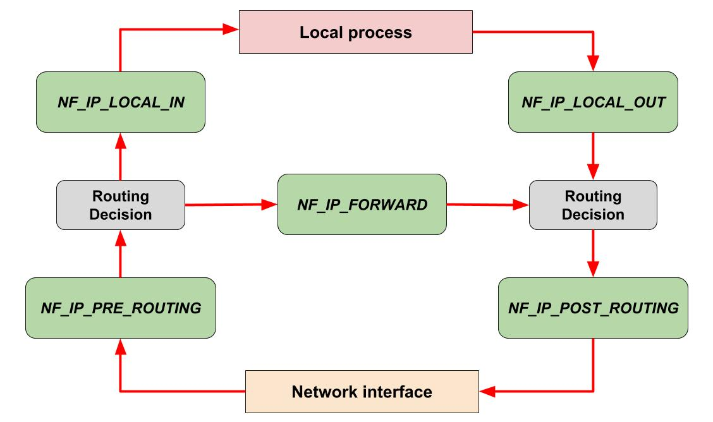
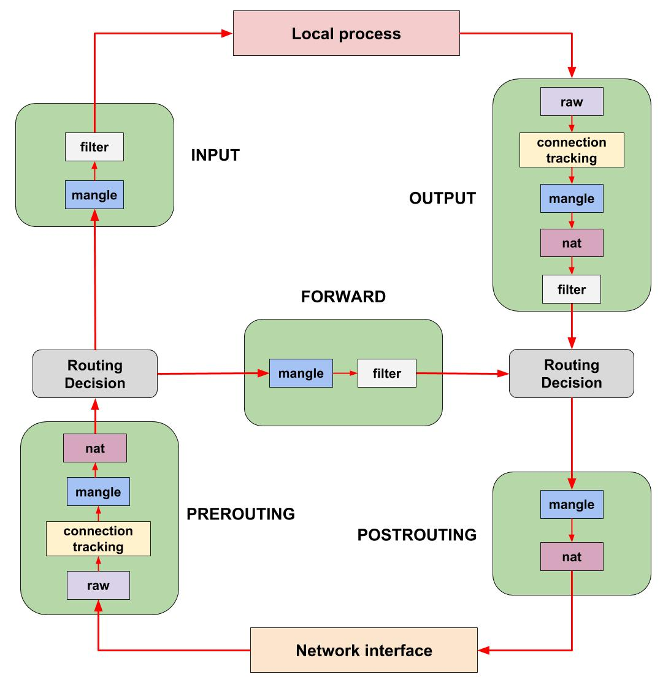

## Linux Firewall: Netfilter/Iptables

_A **packet filter**, or **firewall**, is a piece of software that provides network host security by filtering incoming and outgoing network traffic based on a set of user-defined rules._

A packet filter inspects the [headers of network packets](networking-models.md) as they pass through the [network stack](networking-models.md), and decides the fate of the entire packet. It might decide to _drop_ the packet (i.e., discard the packet as if it had never received it), _accept_ the packet (i.e., let the packet go through), or to do something more complicated such changing a source or destination of the packet.

Under Linux, packet filtering is provided by a kernel module called **netfilter**.

### Netfilter

**Netfilter** is the packet filtering framework inside the Linux kernel. It allows for packet filtering, network address (and port) translation (NAT) and other packet manipulations.

Netfilter provides the **hooks** into the [network stack](networking-models.md) to allow _actions_ to be performed on the packets as they traverse the stack.

Netfilter has five points, or hooks, in the network stack at which it examines packets:

* `NF_IP_PRE_ROUTING`: This hook will be triggered by any incoming packet soon after it enters the network stack. This hook is processed before any routing decisions have been made regarding where to send the packet.
* `NF_IP_LOCAL_IN`: This hook is triggered after after a routing decision has been made to send the packet to a process running on the local system.
* `NF_IP_FORWARD`: This hook is triggered after a routing decision has been made to forward the packet to another network host.
* `NF_IP_LOCAL_OUT`: This hook is triggered by any outgoing packet generated by a local process as soon the packet hits the network stack.
* `NF_IP_POST_ROUTING`: This hook is triggered by any outgoing or forwarded packet after a routing decision has been made on where to send the it further and just before the packet is put out on the wire.



[Read more about netfilter architecture](https://www.netfilter.org/documentation/HOWTO/netfilter-hacking-HOWTO-3.html)

At each of these hooks netfilter allows to register _actions_ to be performed on the packets. These actions are defined in the form of **rules**. The netfilter rules are defined using a user space tool called [iptables](#iptables).

### Iptables

The **iptables** command line utility is a user space interface to [netfilter](#netfilter). It allows to insert and delete **rules** from the kernel's packet filtering table.

#### Tables

The iptables uses **tables** to organize its rules.

_These tables classify rules according to the type of decisions they are used to make._

For instance, if a rule deals with network address translation, it will be put into the **nat** table. If the rule is used to decide whether to allow the packet to continue to its destination, it would probably be added to the **filter** table.

Let's briefly describe built-in tables.

##### filter table

**filter table** is used to make decisions about whether a packet should be allowed to reach its destination. This is the default table in many iptables commands.

##### nat table

**nat table**  allows you to perform network address translation (NAT), i.e. to change the source or/and destination addresses or ports of the packets.

##### mangle table

**mangle table**  is used to alter the IP headers of the packet in various ways. For instance, you can adjust the TTL (Time to Live) value of a packet, either lengthening or shortening the number of valid network hops the packet can sustain. Other IP headers can be altered in similar ways.

This table can also place an internal kernel "mark" on the packet for further processing in other tables and by other networking tools. This mark does not touch the actual packet, but adds the mark to the kernel's representation of the packet.

##### raw table

The iptables firewall is **stateful**, meaning that packets are evaluated in regards to their relation to previous packets. The connection tracking features built on top of the netfilter framework allow iptables to view packets as part of an ongoing connection or session instead of as a stream of discrete, unrelated packets. The connection tracking logic is usually applied very soon after the packet hits the network interface.

The **raw table** has a very narrowly defined function. Its only purpose is to provide a mechanism for marking packets in order to opt-out of connection tracking.

#### Chains

Within each iptables table, rules are further organized in **chains**. While a table holds a collection of rules united by the same function (e.g. filter or nat), chains are groupings of rules which will be evaluated at the same point (hook) in the network stack.

There are **5 built-in chains** which mirror to the names of the netfilter hooks they are associated with:

* `PREROUTING`: rules in this chain are evaluated when `NF_IP_PRE_ROUTING` hook is triggered.
* `INPUT`: rules in this chain are evaluated when `NF_IP_LOCAL_IN` hook is triggered.
* `FORWARD`: rules in this chain are evaluated when `NF_IP_FORWARD` hook is triggered.
* `OUTPUT`: rules in this chain are evaluated when `NF_IP_LOCAL_OUT` hook is triggered.
* `POSTROUTING`: rules in this chain are evaluated when `NF_IP_POST_ROUTING` hook is triggered.

As you can see, _the built-in chains represent a way to specify at which point (netfilter hook) in the network stack the rules will be evaluated._

Each table has multiple chains.

In the picture below are depicted built-in chains (which map to the netfilter hooks) and in each chain (a green rectangle) are shown the names of the tables which include this chain:



From this picture, we can figure that the `nat` table contains three chains: PREROUTING, OUTPUT, and POSTROUTING.

##### Chain Traversal Order

Assuming that the server knows how to route a packet and that the firewall rules permit its transmission, the following chains of rules will be evaluated in different situations:

* _Incoming packets destined for the process running locally:_ `PREROUTING -> INPUT`
* _Incoming packets destined for another network host:_ `PREROUTING -> FORWARD -> POSTROUTING`
* _Locally generated packets:_ `OUTPUT -> POSTROUTING`

If we combine this information with the picture above, we can see that an incoming packet destined for the local system process will first be evaluated against the `PREROUTING` chains of the `raw`, `mangle`, and `nat` tables. It will then traverse the `INPUT` chains of the `mangle`, `filter` tables before finally being delivered to the local [socket](sockets.md).

#### Rules

_Rules are placed within a specific chain of a specific table._

As each chain is called, the packet in question will be checked against each rule within the chain in order (**order of the rules in the chain matters!**)

Each rule has a _matching component_ and an _action component_.

##### Rules matching

_The matching portion of a rule specifies the criteria that a packet must meet in order for the associated action (or [target](#targets)) to be executed._

The matching system is very flexible. Rules can be created to match packets by protocol type, destination or source address, destination or source port, destination or source network, input or output interface, headers, connection state, etc. These can be combined to create fairly complex rule sets to distinguish between different traffic.

##### Targets

_A **target** is the action that is triggered when a packet meets the matching criteria of a rule._

Some targets are **terminating**, which means that they decide the matched packet’s fate immediately. The packet won’t be matched against any other rules in this table's chain. The most commonly used terminating targets are:

* `ACCEPT`: Allows the packet through to its destination or to another chain.
* `DROP`: Drops the packet without responding to the requester. The system that sent the packet is not notified of the failure.
* `REJECT`: The packet will be dropped by the system and an error packet (e.g, “connection reset” packet in case of TCP or a “destination host unreachable” packet in case of UDP or ICMP) will be sent back in response.

Note, that a packet that was accepted in one chain will travel through the [same named chains within other tables](#chains), and could still be dropped there.

On the other hand, there are **non-terminating** targets, which keep matching other rules in the table's chain even if a match was found.

An example of this is the built-in `LOG` target. When a matching packet is received, it logs about it in the kernel logs. However, the packet will be matched against the rest of the rules in the chain after that.

##### Jumping to user-defined chains

We should mention a special class of non-terminating target: the **jump target**.

_Jump targets are actions that result in evaluation moving to a different chain for additional processing._

We've talked quite a bit about the [built-in chains](#chains) which correspond to the netfilter hooks that call them. However, iptables also allows administrators to create their own chains.

Rules can be placed in **user-defined chains** in the same way that they can be placed into [built-in chains](#chains). The difference is that user-defined chains can only be reached by "jumping" to them from a rule (they are not registered with a netfilter hook themselves).

User-defined chains act as simple extensions of the chain which called them. For instance, in a user-defined chain, evaluation will pass back to the calling chain if the end of the rule list is reached or if a [RETURN target](https://www.linuxtopia.org/Linux_Firewall_iptables/x4604.html) is hit by a matching rule. Evaluation can also jump to additional user-defined chains.

### Iptables command line utitlity. Basic examples.

Now that we've covered the basic theory let's look at some basic examples using **iptables command** to define packet filtering rules.

For more examples of iptables commands, see [this post](common-iptables-commands.md).

#### Notes regarding iptables command

1. There are two versions of the Internet Protocol — IPv4 and IPv6. These protocols have some differences and are handled differently in the kernel. Thus, iptables provides different commands for these protocols — `iptables` for IPv4 and `ip6tables` for IPv6.

2. You also need to execute all iptables commands as root.

3. `iptables` works with the `filter` table by default unless you specify another table with the `-t` option.

#### Blocking IPs

The most common use for a firewall is to block IPs. Say for example, you’ve noticed the IP `59.45.175.62` continuously trying to attack your server, and you’d like to block it. We need to simply block all incoming packets from this IP. So, we need to add this rule to the INPUT chain of the filter table:

```bash
# iptables -t filter -A INPUT -s 59.45.175.62 -j DROP
# iptables -A INPUT -s 59.45.175.63 -j DROP
```

Let us break this command down:

*  The `-t` option is used to specify a table. So in our case we're adding this rule to the `filter`. We also omit this part because `filter` is the default table that iptables works with.
* The `-A` option is used to specify a chain to which "append" the rule. In this case we're appending the rule to the end of the `INPUT` chain in the `filter` table.
* The table and the chain specification are followed by the rule matching criteria. The `-s` option is used to specify the source IP that should match on the packet in order for this rule to apply.
* Finally, we specify a target (or action) that should be executed for the matching packets. We specify a target with the `-j` option. In this case we use a [terminating DROP target](#targets).

#### Listing table rules

To see rules contained in the table, use the `-L` flag. It's also helpful to include the `--line-numbers` flag in the command to see the order of the rules within the chains:

```bash
# iptables -L --line-numbers -t filter
Chain INPUT (policy ACCEPT)
num  target     prot opt source               destination
1    DROP       all  --  59.45.175.62         anywhere
2    DROP       all  --  59.45.175.63         anywhere

Chain FORWARD (policy ACCEPT)
num  target     prot opt source               destination

Chain OUTPUT (policy ACCEPT)
num  target     prot opt source               destination
```

As you can see, this command displays all the chains included in this table and lists the rules withing each chain.

iptables also tries to be helpful by doing reverse DNS lookups on the IPs. Often, this is unnecessary and slows down the listing process. To disable this, you can use the `-n` flag:

```bash
# iptables -L -n --line-numbers -t filter
Chain INPUT (policy ACCEPT)
num  target     prot opt source               destination
1    DROP       all  --  59.45.175.62         0.0.0.0/0
2    DROP       all  --  59.45.175.63         0.0.0.0/0

Chain FORWARD (policy ACCEPT)
num  target     prot opt source               destination

Chain OUTPUT (policy ACCEPT)
num  target     prot opt source               destination
```

The rules output contains the following fields:

* `num` – rule number within the chain
* `target` – special [target value](#targets)
* `prot` – protocols, e.g. tcp, udp, icmp, etc.
* `opt` – special options for that specific rule
* `source` – source IP address(es) of the packet that should be matched for this rule to apply
* `destination` – destination IP address(es) that should be matched for this rule to apply

Also note, that the output line which shows the chain name specifies a "policy" in brackets. For example:

```
Chain INPUT (policy ACCEPT)
```

The policy specified within brackes is called the **default chain policy**. It could be one of the terminating targets (`DROP`, `REJECT`, or `ACCEPT`) and specifies the default action that should be taken if a packet doesn't match any of rules in the chain.

#### Persisting iptables rules across reboots

Your current firewall setup is stored in the kernel, and thus will be lost on reboot. There are `iptables-save` and `iptables-restore` commands which allow you to save iptables rules to, and restore them from a file:

```bash
$ sudo iptables-save > iptables.rules
$ cat iptables.rules
# Generated by iptables-save v1.4.21 on Sun Aug 26 04:51:22 2018
*filter
:INPUT ACCEPT [462:29624]
:FORWARD ACCEPT [0:0]
:OUTPUT ACCEPT [307:25424]
-A INPUT -s 59.45.175.62/32 -j DROP
-A INPUT -s 59.45.175.63/32 -j DROP
COMMIT
# Completed on Sun Aug 26 04:51:22 2018
$ sudo iptables-restore < iptables.rules
```

On Debian-based systems you can use `iptables-persistent` package to persist iptables rules across reboots.

On Centos 6 and newer versions you can use the `iptables-services` package to save your iptables rules:

```bash
$ sudo service iptables save
```

This will save your current iptables rules to the `/etc/sysconfig/iptables` file.

#### Other firewall software

There are many alternatives to iptables such as **Uncomplicated Firewall** (UFW) or **FirewallD**. But these tools in fact leverage the iptables command underneath to speak to the netfilter kernel hooks.

Iptables has been slowly replaced with [nftables](https://linux-audit.com/differences-between-iptables-and-nftables-explained/).

And recently [bpfilter has been also announced](https://lwn.net/Articles/747551/) to come as another strong alternative.

### Further reading

* [Common iptables commands](common-iptables-commands.md)

### Resources used to create this document:

* https://www.netfilter.org/documentation/HOWTO//packet-filtering-HOWTO-3.html
* https://searchdatacenter.techtarget.com/tip/Netfilter-and-iptables-Understanding-how-they-harden-Linux
* https://www.digitalocean.com/community/tutorials/a-deep-dive-into-iptables-and-netfilter-architecture
* https://gist.github.com/mcastelino/c38e71eb0809d1427a6650d843c42ac2
* https://wiki.openwrt.org/doc/howto/netfilter
* https://askubuntu.com/questions/579231/whats-the-difference-between-prerouting-and-forward-in-iptables
* https://www.centos.org/docs/5/html/5.2/Deployment_Guide/s2-iptables-options-target.html
* https://www.linuxtopia.org/Linux_Firewall_iptables/x4604.html
* https://www.thegeekstuff.com/2011/01/iptables-fundamentals/
* https://www.digitalocean.com/community/tutorials/what-is-a-firewall-and-how-does-it-work
* man iptables
