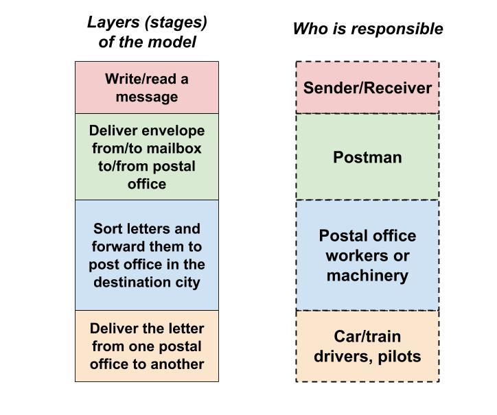
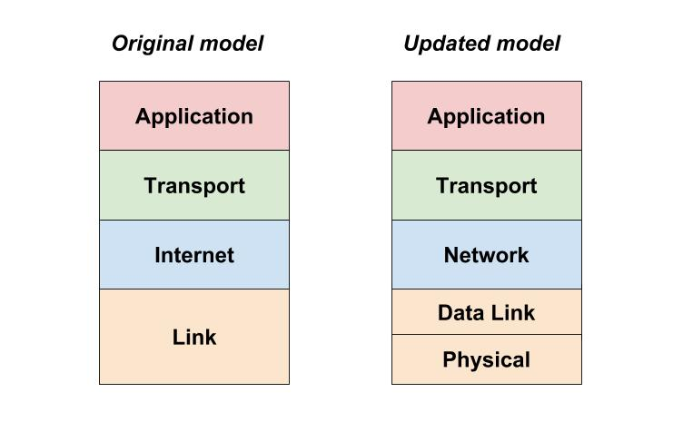
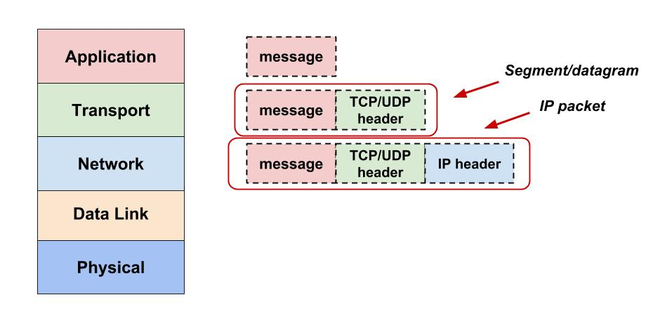
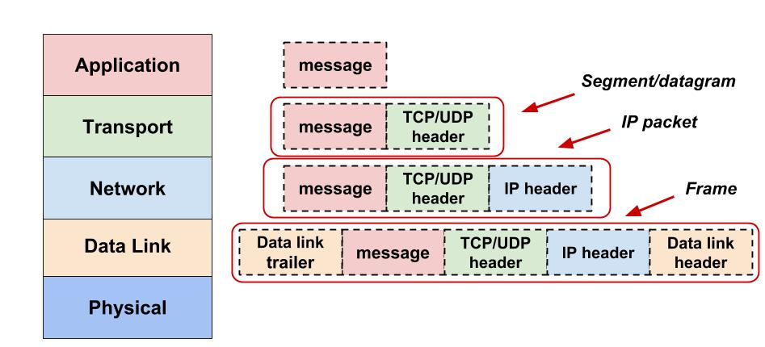
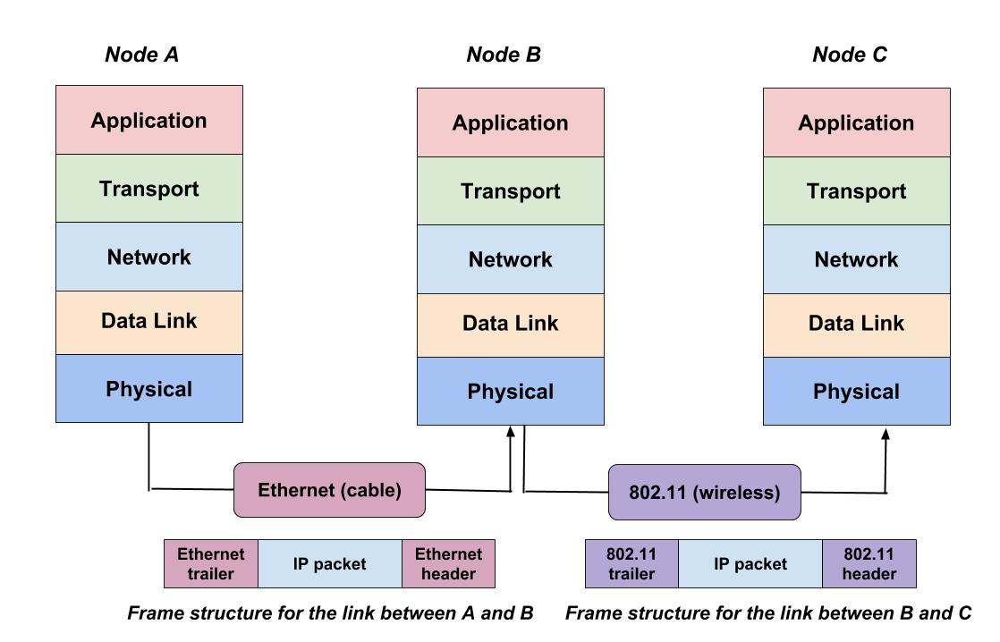
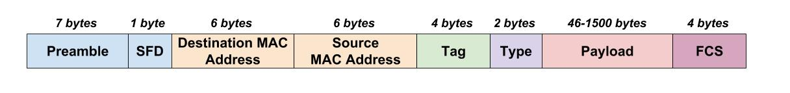

## Networking models

Have you wondered how applications exchange the information over the network?

It looks very similar to how we exchange information over mail. When you want to send a message to another person over mail, you first write your letter, then put it in the envelop, put it in the mailbox from where the postman collects it and delivers to the postal office, in the postal office the letters get sorted, packed and transported to the postal office in the destination city where the postman collects our letter and delivers it to the address of the recipient, finally the recipient reads our message.

As you can see, the process of a sending a letter consists of many stages and many different people are involved at every stage. To better understand how this process looks like and define handoff mechanisms (interfaces) between different people we could create a model in which we would define every stage and who is responsible for each stage:

Now it seems easier to grasp this process by looking at the picture, don't you agree?

But let's return to the original questions of how applications are exchanging messages on the network. As I said, it's indeed looks very similar to how the mail system works.

For example, when you type in your browser `google.com` your browser (the sender) first creates a message (request) in which it specifies what exactly it needs from want from service `google.com` (in this case we just want to see the main page). Then it needs to deliver this message somehow to the computer where the `google.com` service is running. Since we're not directly connected through the wire to that computer, our message will have to go through many other computers (routers), before it reaches the computer we need. Thus, the browser needs to put this message in some kind of envolope in which to specify the address information of `google.com` so it won't get lost on the Internet and could be delivered to the service we want. Once we've got the envelop with all the addressing information, it then has to be somehow transformed in the combinations of electrical signals because that's how we transfer information over all those wires that connect us with the other computers on the Internet.

You see this process, as the mail delivery proces, looks complex as it consists of many different steps and requires a collective work of software and hardware.

I think you would agree, that it would be nice to see a model for this process similar to the one we created for the mail delivery process with all the stages defined and description of who is reponsible for what.

Lucky for us, the models the describe this process already exist, so we don't have to come up with our own :) These models are called **networking models** and there are two primary models that you should know about and which will discuss below: **TCP/IP** and **OSI**.

### TCP/IP model

The **TCP/IP model** (also referred to as **TCP/IP stack**, **Internet model**) has two presentations.

The original model (on the left) has 4 layers, whereas the updated version which is used more often has 5 layers.

At each layer, we have rules that have to be followed for the communication to be successful. These rules consitute a **protocol** of communication.

To better understand what protocol is, let's look again at the mail delivery model from above.

Imagine if you sent your friend a letter written in an unknown to him foreign language. Then your friend simply won't be able to read your message and your communication will fail. To prevent this from happening, both you and your friend have to agree on the rules (e.g. a common language, use of grammar) to follow so you can send and process received information without any problems. These rules that you agree on will constitute a **protocol** of communication at the most upper layer of this mail delivery model.

One layer lower we have another set of rules for a different type of job. For a postman to deliver a letter to the destination mailbox, he needs addressing information which specifies the name of the street, house number. That's why we have to put our letter in the envolope and provide this information for the postman, otherwise our message won't be delivered. These rules consitute another protocol of communication.  

A layer lower we a set of different rules specific to the job functions of this layer which together represent another protocol, and so on. I think you get the idea.

Here are the examples of some of the common `network protocols` used today specified per each layer of the `TCP/IP model`:

|    Layer   |   Protocols   |
|:----------:|:-------------:|
| Application |  HTTP, DNS, POP3 |
| Transport |    TCP, UDP   |
| Network | IP, ICMP |
| Data link | Ethernet,  802.11 |
| Physical | Ethernet,  802.11 |

You will see a big variety of protocols at the Application layer, but layers below have a small number of protocols which are used almost all the time.

Let's now go over each layer of this model and see what functions they perform.

#### Application Layer

The **application layer** protocols define the format of messages that are exchanged between applications.
     
For example, `HTTP` protocol states that if you want to pull a page from a web server, you need to send a message (request) to the web server in which you have to specify a verb identifing what you want (in this case we use the verb `GET`, i.e. get the page) and specify the path of the page you want to pull.

If we send a web server which follows the rules of `HTTP` protocol a message in different format, e.g. defined by `DNS` protocol, the web server won't understand us. It's the same as sending him a message written in the language he doesn't speak.

#### Transport Layer

The **transport layer** is responsible for connecting the sender and receiver of the message.

If we compare it to the previous mail delivery model, this layer is the postman which takes the message from the sender's mailbox (one end of communication) and delivers it to the recipient (another end of communication). Thus, the main function of this layer is to _provide end-to-end communication between applications_.

The postman delivers mail to a person using his living address which identifies him among thousands of people living in the city. But how one delivers a message to an application running on the computer?

On one computer we usually run multple processes (applications) and the application we need is just a single one of them. To identify the required process we use **ports**. Basically, if an application wants to provide its services over the network, it should be configured to listen for requests on some **port** which should be know to clients on the network. The port number is like an address of the application on the computer which helps to identify it among other applications on the same computer.

The two protocols that govern the communication at this layer are **TCP** and **UDP**.
    
The **TCP** works by establishing a connection, i.e. a channel for communication between the sender and the receiver. TCP requires that the sending and receiving application should be both identified by a port number. The port numbers are added to the header of the message.

It also ensures that the data received by the destination computer before being delivered to the applicaiton is cheched for corruption which might have happened during the data transmission. This is achieved by computing the calculating the checksum of the **segment** at the both the sender and the receiver end. The segment is the message passed from the application layer + TCP header. It is the unit of data information TCP operates on. The checksum info also goes to the header attached by TCP.

Because the message to transmit could be big (e.g. downloading a large file), the message is split into small chunks (groups of bytes) which are used for transmission. This way we avoid network congestion and multiple applicaitons can use the network at the same time. TCP ensures that the received bytes are put in the right order at the receiving host. This is acheived by including a `sequence number` in the header of each segment.

The TCP header also includes the `acknowledgement number`. Basically, both ends of communication syncronize what data was sent and what was received, and if anything gets lost or corrupted, it gets retransmitted.

As you can see the TCP provides a reliable way delivery of the data. You can read more additional fields in the TCP header [here](https://en.wikipedia.org/wiki/Transmission_Control_Protocol).

Another commonly used protol at this layer is **UDP**. It is much simpler and more lightweight than TCP. Unlike TCP, UDP doens't establish a connection, doesn't acknowledge the receipt of the data nor check its integrity. Thus it doesn't provide a reliable data delivery. But it works much faster than TCP, because it doesn't have to perform any extra actions and is often used in video/audio calls when the speed is prefered over a small percentage of data loss or data being received out of order.

#### Network/Internet Layer

If at the `transport layer` we concerned ourselves with identifing applications at the both ends of communication over the network, at the **network layer** we are focusing on how to move the data from one computer to another.

The `network layer` includes a small number of protocols, but only one major protocol: the **Internet Protocol** (**IP**).

By the way, the `TCP/IP model` received its name after the names of the two protocols (`TCP` and `IP`) which consitute the backbone of today's network communication.

Let's go back to our mail delivery model again. Remember that before that before a postman can deliver the mail to the destination address, it first have to travel from one postal office (in the sender's city) to another (in the recipient's city). To identify a destination postal office we use `postal codes` which is a sequence of characters (typically numbers) we put on the envelope.

In computer networks, we use a similar concept. Each host on the network gets assigned an **IP address** which is a `logical address` (not bound to hardware) that allows to identify that host on the network.

The two most important functions of the `network layer` are `routing` and `forwarding`.

**Routing** is the process of selecting the best path for a message to take to reach its destination. Similar to how a postal service has regular routes to deliver mail based on the destination of the letters, hosts on computer networks have their own routes to deliver messages.

**Forwarding** is the process of sending the received messages to the next point (**hop**) on its way to the final destination. The letter that send may not have a direct route from one postal office to another and may have several stops at other cities along the way from where it will be moved (forwarded) to the destination. The same happens with messages on the computer networks. A message can go through multiple computers and other common network equipment such as routers and switches until it reaches its destination. And all those devices will be able to route and forward the message to its destination, because they all understand the rules of communication at the layer defined by IP protocol.

So what rules define the IP protocol? First and foremost, the data exchanged at this level should certain information. For network devices to perform routing and forwarding of messages, they need to have an IP address the recipient computer (`destination address`). The message should also have an IP address of a sending computer (`source address`) for the receiving computer to be able to send a response.

These addressing information similar to the port information at the layer above is included in a new header which IP layer adds to a segment/datagram (message + TCP/UDP header). There resulting unit is called an **IP packet**.

I think you should see a pattern now how each layer adds extra information (header) specific to the functions of this layer on top of the data it received from the upper layer. This process is called **encapsulation**. Basically, it looks like adding more and more envelops on top of a message: the application created a message, at transport layer we put that message in an envelop and put application addresses (ports) and some other infromation, next at the network layer we put the envelop received from the transport layer in another envelop and wrote computer addresses (IP addresses) on top and so on.

Encapsulation allows each layer to work only with the information it needs to perform its functions. Imagine, if we put everything in one message: the message itself, ports, checksums, IP addresses, etc. Then at each layer we would have to read the whole message and look for information required at this layer, then remove it from the message because the receiving application does need all this extra information. It would be very time consuming and very troublesome!

As you can guess, there is a reverse process called **de-encapsulation**. When we receive the data on the network, we start unwrapping all the envelops (headers) at each layer as we're moving the data up through the layers so that in the end the application only receives the letter (message) that was sent.

#### Link layer: Data Link and Physical

The last layer in the original TCP/IP model and the last 2 in the updated model are concerned with node-to-node communication. If the network layer was responsible for routing the data, i.e. determining to which node on the network to send the data, and providing addressing information, the data link and physical layers are responsible for actually moving the data from one node to another.

Again, it's similar to how the mail delivery works. At the postal office we receive the envelops, sort them and make a decision to which postal office they should forwarded next. But people who are moving those letters from one city to another are not the same people who sit at the postal office and sort the letters. This layer of responsibility is delegated to car drivers, train drivers, pilots that carry the mail over the long distance such as between postal offices in different cities/countries.

In computer networks, there are also multiple means of data tranportation. The data could be carried over a different environment (**medium**): a copper cable, fiber, wireless. Each medium has its own rules to encode and transmit bits of information which are regulated by protocols at the **physicall layer**. For example, in case of copper cables bits of infomation will be encoded and transmitted as electrical signals, in case of wireless it will be radio signals, etc.

But the question arises how network host recognize IP packets of all these different applications among a stream of electrical or radio signals? Besides, it's quite common for multiple hosts to share the same medium. For instance, there are often multiple devices that use the same Wi-Fi access point. How can they transmit the data and avoid collisions? There are some the questions answered by the **data link layer**.

_The data link layer acts as a bridge between the software and the hardware._ It is responsible for carrying IP packets between two adjacent nodes over a physical link (copper, fiber, wireless). The physical layer deals with bit streams which are represented by electical/light/radio signals. It is the job of the data link layer to recognize IP packets in those streams of bits.

The data link works with data units called **frame**. A frame is another envelop in our chain of envelops. It includes a data link header, the IP packet received form the network layer and a trailer:

As you can recall, each envelop includes information specific to the functions of the layer. In the case of the data link layer, the information provided in the header and the trailer is used to carry an IP packet over a physical link between two adjacent nodes.

We've already mentioned, that the type of physical link can vary as the packet travels through the network: copper, fiber, wireless, etc. Since different physical layer protocols (e.g., Ethernet, 802.11) govern the transmission of the data over different mediums, the information included in the header and the trailer of the frame will vary and will be specific to that physical link and its protocol.

On this picture, the node B receives the frame from node A over the Ethernet link, decapsulates the frame into an IP packet, looks at the destination IP address and performs routing (chooses the next hop), then constructs a new frame for the IP packet appropriate for the next medium type (wireless) and forwards the packet inside the new frame to the next hop.

So a good definition of **frame** could be an IP packet encoded for transmission on a particular type of physical link.

But what exactly is included in the header and the trailer of a frame?

Well, it depends on the physical layer protocol in use. Let's look at the **Ethernet** frame as an example.

The Ethernet frame includes the following fields:
* `Preamble` is 8 bytes (or 64 bits) long and can itself be split into two sections. The first seven bytes are a series of alternating ones and zeros. These act partially as a buffer between frames and can also be used by the network interfaces to synchronize internal clocks they use to regulate the speed at which they send data. 
* The `SFD` (`Start Frame Delimiter`) Flag is another standard byte pattern agreed between the sender and receiver. The purpose of the SFD Flag is to enable the receiver to know the position of the actual frame header. On seeing the SFD flag byte, the receiver would know that the actual frame contents start immediately after the SFD flag. For e.g. Ethernet uses the SFD byte with value 10101011. So, when a receiver receives the preamble pattern, followed by this SFD byte, it can start processing the actual frame contents starting from the byte immediately succeeding the SFD byte. These is how frames are differentiated between that continuous stream of bits on the wire.
* `Destination MAC address` is a unique physical (hardware) address of the receiving node. Unlike an IP address (logical address), it's hard-wired into every network device by the manufacturer.
* `Source MAC address`is a unique physical address of the sending node.
* `Type` (also referred to as `length`) is used to identify what network protocol is being carried in the frame, e.g. IPv4 or IPv6. It's worth noting that instead of the `Type` field, you could also find what's known as a `VLAN header` (`Tag`). It indicates that the frame itself is what's called a VLAN frame. If a VLAN header is present, the `Type` field follows it.
* `Payload` in networking terms is the actual data being transported, which is everything that isn't a header (or trailer). The data payload of a traditional Ethernet frame can be anywhere from 46 to 1500 bytes long.
* The frame trailer includes consists of the `FCS` field which stands for Frame Check Sequence. It is used for to detect bit corruption which can happen as a result of different noise sources on the link. The sending node uses a mathematical algorithm called `CRC` to calculate a [hash](terms.md) of the frame before sending. The receiving node uses the same algorithm on the received data to make sure it was not corrupted during the trasmission before accepting the frame as valid.

Let's briefly sum up the functions of the last two layer. The `data-link layer` takes packets from the network layer and puts it into frames of bits: 1s and 0s for transmission on the physical link. It then sends each frame bit-by-bit to the physical layer which converts the bits into the sequence of signals (radio, light, electrical). At the receiver’s end, data link layer picks up signals from hardware and assembles them into frames, checks frames for errors and finally passes the IP packet to the network layer.

One important function of the data link layer that we forgot to mention is that it controls the communication on the shared medium and [puts mechanisms in place to prevent collisions](https://www.youtube.com/watch?v=0nUERzTBJbQ) of the frames, i.e. situations when multiple nodes start transmitting at the same time on the same medium.

### The role of TCP/IP in the modern world

Today, all the computer system networking is based on the TCP/IP model. It is often referred to as **the language of the Internet**, because applications are typically built around this model and its protocol suite.

However, the world has not always been so simple. Before the TCP/IP model became so dominant, vendors created the first networking protocols; these protocols supported only that vendor’s computers. For example, IBM published its Systems Network Architecture (SNA) networking model in 1974. Other vendors also created their own proprietary networking models. As a result, if your company bought computers from three vendors, network engineers often had to create three different networks based on the networking models created by each company, and then somehow connect those networks, making the combined networks much more complex.

Today, when you buy a new computer today, it implements the TCP/IP model to the point that you can usually take any computer out of the box, plug in all the right cables, turn it on, and it connects to the network. You can use a web browser to connect to your favorite website. How? Well, the OS on the computer implements parts of the TCP/IP model. The Ethernet card, or wireless LAN card, built into the computer implements some LAN standards referenced by the TCP/IP model. In short, the vendors that created the hardware and software implemented TCP/IP.

### Resources used to create this document:

* https://www.safaribooksonline.com/library/view/Cisco+CCENT_CCNA+ICND1+100-101+Official+Cert+Guide/9780133497342/ch01.html#ch01
* https://www.quora.com/Can-you-explain-OSI-layers-and-TCP-IP-in-laymans-terms
* http://computernetworkingsimplified.in/data-link-layer/general-data-link-layer-frame-structure/
