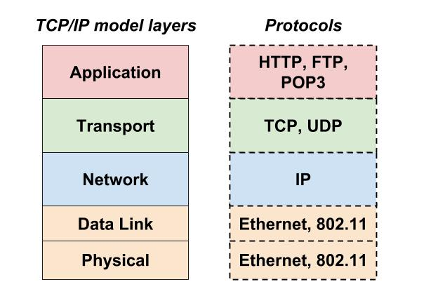
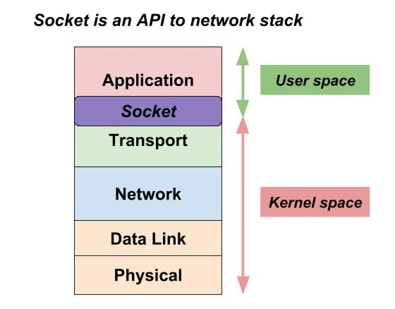
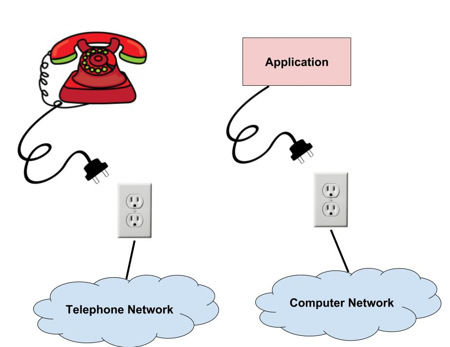
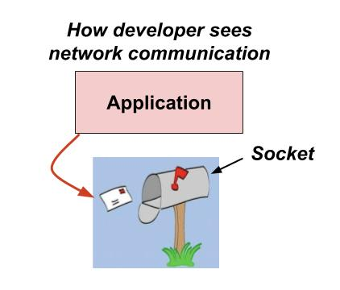
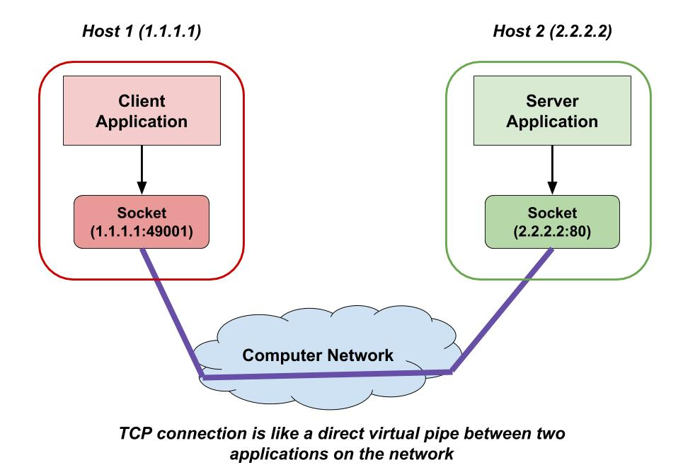

## Sockets

Communication between application on the network is a complex process. It's commonly described by `TCP/IP` or `OSI` [networking models](networking-models.md) which divide this process in steps (layers).

Let's look again at the layers of `TCP/IP` model:



Briefly and simplified, the process of exchanging data between the applications on the network could be described like this:

* In the most upper layer of this model, the `application` forms a message according to the rules of one of the applications protocols like HTTP
* The `transport layer` ensures the delivery of the message to the right process (application) running on the computer: port numbers identifying the process on sending host and the process on the receiving host are added to the header of the message.
* The `networking layer`, mainly governed by the IP protocol, ensures the delivery of the message to the right host (computer). It provides a logical addressing scheme which allows to identify each host on the network by an IP address, that's why at this layer we add a new header to our message with IP addresses of sending and receiving host.
* The `data link layer` provides the transmission of those IP packages between two adjacent hosts over a physical link (copper cables, fiber, wireless). It does this by adding a header and trailer bytes specific to the physical layer protocol that allow to distinguish the packets of data among the electical/light/radio signals on the link and ensure the data doesn't get corrupted during the trasmission.
* The `physical layer` converts the bits of data received from the data link into electical/light/radio depending on the type of physical link medium.

But a few question arise. Who does all this job at each layer? And as person who develops an application and works at the top layer, do I need to worry about all these lower layers? For example, do I have to worry about how my application data is converted to electrical signals?

Luckily, in most cases, you don't have to worry anything below the application layer as the functions of all the layers below are provided by the operating system (OS). This is achieved by using **sockets**.

What is a **socket**?

_A socket is an abstraction (interface) that is provided to an application programmer by the OS to send/receive data over the network to a process which is running on a remote host or the same host._



This term `socket` has come from an electricity/phone socket metaphor where a socket acts as an interface that you have to plug into in order to connect to the electical/phone network.



You can think of socket as a mail box for your applicaiton messages. You put your message in the box and it gets delivered to the right address without you having to know all the details about how it's done.



Similarly, the networking stack will handle queueing, retransmission, error-checking and reassembly of the data packets. For the application all these functions stay opaque and the proccesses running on different machines communicate with each other by sending messages into sockets (similar to how we put letters in the mailbox). Thus, **a socket is essentially one endpoint of a two-way communication link between two programs running on the network.**

As everything in Linux, socket is a file. But it's a special type of file because data written to a socket goesn't get written to disk, but instead is sent over the network.

There two types of sockets: **Internet sockets** and **Unix domain sockets**.

### Internet sockets

This is by far the most popular type of sockets. Internet sockets are used for communication between processes running on different network hosts.

As you can recall, each host on the network is identified by IP address and a process (application) on that host is idenfied by a port number. This is the essential addressing information required to deliver a message from application on one host to application on another host. That is why this information (i.e. IP address and port) is associated (bound) to an Internet socket which is responsible for data delivery over the network.

A combination of an IP address and a port number is sometimes referred to as `socket address` or simply `socket`, much like one end of a telephone connection is the combination of a phone number and a particular extension.

Within the operating system and the application that created a socket, the socket is referred to by a unique integer number called `socket identifier` or `socket number`. The operating system forwards the payload of incoming IP packets to the corresponding application by extracting the socket address information from the IP and transport protocol headers and stripping the headers from the application data.

There are several Internet socket types:

1. `Datagram sockets`, also known as `connectionless sockets`, which use User Datagram Protocol (UDP)
2. `Stream sockets`, also known as `connection-oriented sockets`, which use Transmission Control Protocol (TCP)
3. `Raw sockets` (or `Raw IP sockets`), typically available in routers and other network equipment. Here the transport layer is bypassed, and the packet headers are not stripped off, but are accessible to the application. Protocol examples that use this type of sockets includes Internet Control Message Protocol (ICMP, widely known because of the `ping` command which uses it).

Because sockets play a central role in client/server applications, client/server application development is also referred to as **socket programming**.

#### Socket Programming with TCP

TCP provides a connection oriented service, since it is based on connections between clients and servers.
Connection-oriented means that a connection (communication channel) is established before processes start to exchange data. The TCP is also considered reliable because when one end of communication (i.e a client or a server) sends the data, it expects an acknowledgement from another end (i.e. the receiver) that the data was received. If an acknowledgement is not received, TCP automatically retransmit the data and waits for a longer period of time.

As we mentioned, processes running on different machines communicate with each other by sending messages into sockets.

_From the application's perspective, the TCP connection is a direct virtual pipe between the client's socket and the server's connection socket._



The client process can send arbitrary bytes into its socket; TCP guarantees that the server process will receive (through the connection socket) each byte in the order sent. Furthermore, the client process can also receive bytes from its socket and the server process can also send bytes into its connection socket, meaning a single  socket supports both reading and writing.

Let's look at how a typical client application works:

1. Prepare to communicate:
* Create a socket. The client also needs to identify itself to the server so the socket is assigned a free local port (usually by the OS) that it will use during this connection.
* Determine server address and port number
* Initiate a TCP connection to the server
2. Exchange data with the server
* Write data to the socket
* Read data from the socket
3. Manipulate the data (e.g., display email, play music)
4. Close the socket

Let's look at how a typical server application works:

1. Prepare to communicate
* Create a socket and bind (associate) local address and port with the socket
2. Wait to hear from the client
* Accept an incoming connection from a client
* Create a new socket. A server needs a new socket so that it can continue to listen to the original socket for connection requests while serving a connected client. The new socket (its socket identifier maintained by the operating system) is bound not to just a local IP address and a port, but a **socket pair**. A socket pair is a combination of the local socket address (i.e. IP address + port) and remote socket address. 
3. Exchange data with the client over the new socket
* Receive data from the socket
* Do stuff to handle the request (e.g., read a file)
* Send data to the socket
* Close the socket
4. Repeat with the next connection request

As an example, let’s look at the system calls that a simple invocation of [curl](curl.md) does:

```bash
$ strace -esocket,connect,sendto,recvfrom,close curl -s example.com > /dev/null
...
socket(PF_INET, SOCK_STREAM, IPPROTO_TCP) = 3
connect(3, {sa_family=AF_INET, sin_port=htons(80), sin_addr=inet_addr("93.184.216.34")}, 16) = -1 EINPROGRESS (Operation now in progress)
sendto(3, "GET / HTTP/1.1\r\nUser-Agent: curl"..., 75, MSG_NOSIGNAL, NULL, 0) = 75
recvfrom(3, "HTTP/1.1 200 OK\r\nAccept-Ranges: "..., 16384, 0, NULL, NULL) = 1599
close(3)                                = 0
+++ exited with 0 +++
```

We use the [strace](strace.md) command to observe the Socket API calls:

1. A socket is opened with `socket` function call, and the type is specified as IPv4/TCP.
2. `connect` launches the TCP handshake. Destination address and port are passed to the function.
3. After the connection is successfully established, `sendto` is used to write data to the socket - in this case, the usual HTTP GET request.
4. From that point on, [curl](curl.md) eventually reads the incoming data with `recvfrom`

#### Socket Programming with UDP

UDP is a connection-less, datagram protocol. The client does not establish a connection with the server like in case of TCP. Instead, the client just sends a datagram to the server using the sendto function which requires the address of the destination as a parameter. Similarly, the server does not accept a connection from a client.

Instead, the server just calls the `recvfrom` function, which waits until data arrives from some client. recvfrom returns the IP address of the client, along with the datagram, so the server can send a response to the client. There isn’t any initial handshaking phase. It lacks reliability because when you send a data or message, you don't know if it'll get there, it could get lost on the way. There may be corruption while transferring a message.

#### Socket states

Computer processes that provide application services are called **servers**, and create sockets on start up that are in **listening state**. These sockets are waiting for initiatives from client programs.

A TCP server may serve several clients concurrently, by creating a new socket for each client connection. This new socket is associated with a `socket pair` (local socket address + remote socket address). This socket is said to be in the **established state** because it essentially means an established TCP connection between a client and a server.

You can check the state of a socket by using the [netstat](netstat.md) command.

There are other possible TCP socket states presented by the `netstat` command such as Synsent, `Syn-Recv`,`Time-wait`, `Closed`, etc. which relate to various start up and shutdown steps of a TCP connection.

A UDP socket cannot be in an `established state`, since UDP is _connectionless_. Therefore, `netstat` does not show the state of a UDP socket. A UDP server does not create a new socket for every new client, but the same
socket is used to receive incoming data packets from all remote clients. This implies that UDP sockets are not identified by the remote address, but only by the local address, although each message has an associated
remote address.

### Resources used to create this document:

* http://inst.eecs.berkeley.edu/~ee122/sp07/Socket%20Programming.pdf
* http://www.saminiir.com/lets-code-tcp-ip-stack-4-tcp-data-flow-socket-api/#socket-api
* http://ijcsit.com/docs/Volume%205/vol5issue03/ijcsit20140503462.pdf
* http://uotechnology.edu.iq/ce/Lectures/AhmedSaad-IT/part4.pdf
* https://docs.oracle.com/javase/tutorial/networking/sockets/definition.html

**NOTE:** some of the presentations and articles can be found in the papers folder:
* [file1](../papers/socket-programming.pdf)
* [file2](../papers/socket-programming2.pdf)
* [file3](../papers/socket-programming3.pdf)
